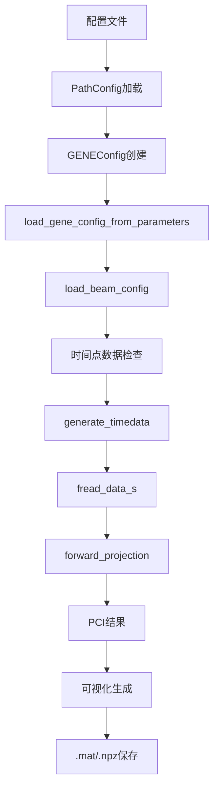
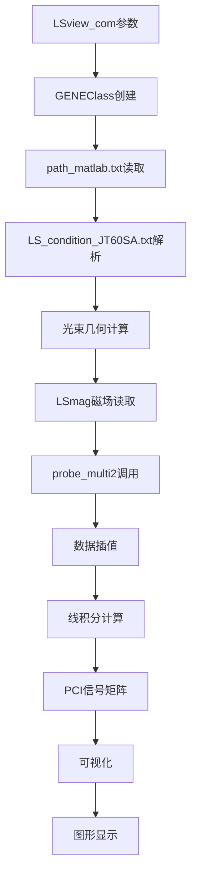

# Python与MATLAB PCI分析运行流程对比

**版本**: 1.0  
**日期**: 2025年11月9日  
**目的**: 详细对比`run_pci_single_time.pbs`与MATLAB运行流程的异同

---

## 目录

1. [流程概览](#流程概览)
2. [Python运行流程](#python运行流程)
3. [MATLAB运行流程](#matlab运行流程)
4. [数据处理对比](#数据处理对比)
5. [关键差异分析](#关键差异分析)

---

## 流程概览

| 步骤 | Python流程 | MATLAB流程 |
|------|------------|------------|
| 启动方式 | `qsub run_pci_single_time.pbs` | `octave --no-gui --eval "LSview_com('GENE', 301, 98.07, 4)"` |
| 环境 | Python虚拟环境 + GPU支持 | Octave + MATLAB兼容环境 |
| 主入口 | `run_pci.py --task single_time` | `LSview_com.m`函数 |
| 核心计算 | PyTorch + GPU加速 | MATLAB原生计算 |
| 输出格式 | .mat + .npz + PNG图像 | MATLAB图形窗口 + 数据文件 |

---

## Python运行流程

### 1. PBS脚本执行 (`run_pci_single_time.pbs`)

```bash
# 第1-2行: PBS作业配置
#!/bin/bash
#PBS -P DTMP -N pyPCI_single_time -q B_dev
#PBS -l select=1:ncpus=24:mem=124gb:ngpus=1

# 第9行: 工作目录切换
cd "$PBS_O_WORKDIR"

# 第12-22行: 虚拟环境激活
if [ -d "venv" ]; then
    source venv/bin/activate
elif [ -d ".venv" ]; then
    source .venv/bin/activate
else
    python3 -m venv venv
    source venv/bin/activate
fi

# 第30-35行: GPU模块加载
module load rocm 2>/dev/null || true
rocm-smi --showproductname --showmeminfo vram || true

# 第45行: 核心Python脚本执行
python run_pci.py --task single_time
```

**关键操作**:
- 分配24核CPU + 124GB内存 + 1个GPU
- 自动检测并激活Python虚拟环境
- 加载ROCm GPU支持模块
- 显示GPU和Python环境信息

### 2. 主程序执行 (`run_pci.py`)

#### 2.1 配置加载阶段
```python
# 第287-352行: main()函数
parser = argparse.ArgumentParser(description='PCI分析统一入口')
args = parser.parse_args()

# 加载配置文件
config = load_config('config/paths.json')  # 第307行
```

**配置文件内容** (`config/paths.json`):
- 输入数据根目录: `/work/DTMP/lhqing/PCI/Data/matlab_input`
- 数据编号目录: `301`
- 参数文件: `parameters.dat`
- 光束配置文件: `LS_condition_JT60SA.txt`
- 输出目录: `/work/DTMP/lhqing/PCI/Data/sample/output`

#### 2.2 单时间点分析核心函数 (`run_single_time()`)

**第36-203行详细流程**:

```python
# 步骤1: 路径配置
path_config = PathConfig.from_config_file("config/paths.json")
path_config.create_output_dirs()

# 步骤2: GENE配置加载 (第55-60行)
gene_config = load_gene_config_from_parameters(
    str(path_config.parameters_file),        # parameters.dat
    str(path_config.input_dir),              # matlab_input/301
    device=device
)

# 步骤3: 光束配置加载 (第62-63行)
beam_config = load_beam_config(str(path_config.beam_config_file))  # LS_condition_JT60SA.txt

# 步骤4: 时间点处理 (第66-80行)
time_point = task_config['time_point']      # 98.07
time_int = int(time_point * 100)            # 9807
binary_file = path_config.get_binary_data_file(time_int)

# 检查并生成二进制文件
if not binary_file.exists():
    text_file = path_config.get_time_data_file(time_int)  # TORUSIons_act_9807.dat
    if text_file.exists():
        from pci_torch.data_loader import generate_timedata
        binary_file = generate_timedata(gene_config, str(text_file), time_point, str(path_config.input_dir))
    else:
        raise FileNotFoundError(f"数据文件不存在: {text_file}")

# 步骤5: 密度场数据读取 (第86-89行)
from pci_torch.data_loader import fread_data_s
density_3d = fread_data_s(gene_config, str(binary_file), device=device)
print(f"  密度场shape: {density_3d.shape}")  # 通常为 (nx0, nky0, nz0)

# 步骤6: PCI正向投影 (第92-96行)
pci_result, debug_info = forward_projection(
    density_3d, gene_config, beam_config, 
    device=device, 
    return_line_integral=False, 
    return_debug_info=True
)
```

**步骤7: 结果保存 (第98-145行)**
```python
# 保存为MATLAB兼容格式
import scipy.io as sio
debug_data = {
    'pci_signal': pci_result.cpu().numpy(),
    'time_point': time_point,
    'var_type': task_config['var_type'],
    'data_n': task_config['data_n'],
    'device': device
}
sio.savemat(str(output_path), debug_data)  # single_time_t98.07_var4.mat
```

**步骤8: 可视化生成 (第146-196行)**

```python
# 生成5个主要图形
visualizer = PCIVisualizer(gene_config)

# Figure 1: 3D光束几何图 (第155-159行)
from pci_torch.beam_geometry import compute_beam_grid
beam_grid = compute_beam_grid(beam_config, device)
visualizer.plot_beam_geometry_3d(beam_grid, beam_fig_path)

# Figure 3: 检测器信号等高线图 (第162-166行)
visualizer.plot_detector_contour(pci_result, beam_config, time_point, detector_fig_path)

# Figure 2: 光束路径信号分布图 (第169-181行)
# 重新计算获取线积分结果
pci_result, debug_info = forward_projection(..., return_line_integral=True, ...)
pci_signal_1d = pci_result.flatten()  # 对应MATLAB的abs(pout)
create_beam_path_signal_plot(pci_signal_1d, beam_signal_fig_path)

# Figure 4: 2D波数空间图 (第184-189行)
from pci_torch.visualization import plot_wavenumber_space_2d
plot_wavenumber_space_2d(None, None, pci_result, gene_config, wavenumber_fig_path)
```

#### 2.3 数据流处理细节

**输入数据处理**:
1. **parameters.dat**: GENE仿真参数 → `GENEConfig`对象
2. **TORUSIons_act_9807.dat**: 时间序列数据 → 二进制转换 → 3D密度场
3. **LS_condition_JT60SA.txt**: 光束配置 → `BeamConfig`对象
4. **equdata_BZ/be**: 平衡数据 → 磁场和电场信息

**中间数据**:
- `density_3d`: shape为(nx0, nky0, nz0)的张量
- `beam_grid`: 光束几何网格坐标
- `pci_result`: PCI投影结果张量
- `debug_info`: 包含所有中间计算结果

**输出数据**:
- `.mat`文件: MATLAB兼容格式
- `.npz`文件: 详细调试数据
- 5个PNG图像: 各种可视化结果

---

## MATLAB运行流程

### 1. 启动命令执行
```bash
cd /work/DTMP/lhqing/PCI/code/TDS_class/plot
octave --no-gui --eval "LSview_com('GENE', 301, 98.07, 4)"
```

**参数说明**:
- `'GENE'`: 仿真类型 (第20-26行)
- `301`: 数据编号
- `98.07`: 时间点
- `4`: 变量类型 (潜在扰动)

### 2. LSview_com函数执行流程

#### 2.1 初始化阶段 (第7-26行)
```matlab
% 路径设置
oldpath=path;
path('../com',oldpath);
f_path='path_matlab.txt';  % 路径配置文件

% 仿真类型选择
switch sim
    case 'GENE'
        FVER=5;
        dataC=GENEClass(f_path,data_n);  % 创建GENE数据对象
```

#### 2.2 条件文件读取 (第54-74行)
```matlab
f_condition='./LS_condition_JT60SA.txt';
A=importdata(f_condition,',',5);

% 解析光束参数
if iscell(A)
    data1 = sscanf(A{1}, '%f,');
    pp1 = data1;  % 光束起点和终点坐标
    wid1 = data2(1);  % 光束宽度1
    wid2 = data2(2);  % 光束宽度2
    div1 = data3(1);  % 分割数1
    div2 = data3(2);  % 分割数2
    divls = data3(3);  % 沿光束路径分割数
```

#### 2.3 几何计算 (第76-148行)

**光束坐标转换 (第81-84行)**:
```matlab
% (R,Z,phi) -> (X,Y,Z) 笛卡尔坐标
B2(:,1)=B1(:,1).*cos(2*pi*B1(:,3));
B2(:,2)=B1(:,1).*sin(2*pi*B1(:,3));
B2(:,3)=B1(:,2);
B2=B2/1000.0;  % 转换为米
```

**光束网格生成 (第117-147行)**:
```matlab
divls_2=divls+1;
div1_2=2*div1+1;
div2_2=2*div2+1;
num=div1_2*div2_2;

% 生成3D光束网格
xls=ones(div1_2,div2_2,divls_2)*B2(2,1);
yls=ones(div1_2,div2_2,divls_2)*B2(2,2);
zls=ones(div1_2,div2_2,divls_2)*B2(2,3);

% 填充光束截面和路径
for j=1:div1_2
    replix(j,:,:)=ones(div2_2,divls_2)*(real(j-1)-div1)/div1;
end
% ... 更多的网格填充代码 ...
```

#### 2.4 可视化生成 (第149-184行)

**Figure 1: 3D光束几何图**:
```matlab
figure(1)
plot3(B2(:,1),B2(:,2),B2(:,3),'o');  % 标记光束端点
hold on
plot3(xls1,yls1,zls1,'.');  % 绘制光束路径
plot3(xls_b(1:2:end,:).',yls_b(1:2:end,:).',zls_b(1:2:end,:).','k-');  % 托卡马克边界
```

#### 2.5 核心数据处理 (第186-205行)

**平衡数据读取**:
```matlab
LSmag(dataC,divls_2,xls_c,p1);  % 读取磁场数据

% 坐标转换: (X,Y,Z) -> (r,phi,z)
r1=sqrt(xls.*xls+yls.*yls);
phi1=atan2(yls,xls);
```

**PCI投影计算**:
```matlab
% 调用核心函数
if FVER == 5   % GENE
    [pout,R,Z]=probe_multi2(sim,data_n,t,num1,x1,var,p1);
else
    pout=probe_multi(sim,data_n,t,num1,x1,var);
end
```

#### 2.6 结果处理和可视化 (第221-248行)

**线积分和等高线图 (Figure 3)**:
```matlab
if (t~=0)
    pout1=reshape(pout,div1_2,div2_2,divls_2);
    % 沿光束路径积分
    pout2=sum(pout1,3);
    
    figure(3)
    contourf(yy1.',xx1.',pout2,100,'LineStyle','none');  % 等高线图
    shading flat;
    axis equal;
    colorbar
end
```

**2D波数空间 (Figure 4)**:
```matlab
figure(4)
plotWaveNumberSpace(yy1.',xx1.',pout2,dataC)
```

#### 2.7 probe_multi2函数分析

**GENE数据处理关键步骤**:
1. 读取`00009807.dat`二进制文件 (如果不存在则调用`generate_timedata`生成)
2. 3D密度场插值到光束路径
3. 沿光束路径进行线积分
4. 返回PCI信号矩阵

---

## 数据处理对比

### Python数据流程


### MATLAB数据流程


### 关键差异对比

| 方面 | Python | MATLAB |
|------|--------|--------|
| **数据加载** | 模块化设计，分别处理参数、光束、平衡数据 | 统一在GENEClass中处理 |
| **内存管理** | PyTorch张量，支持GPU加速 | MATLAB数组，CPU计算 |
| **中间结果** | 详细保存调试信息 | 主要在内存中处理 |
| **并行计算** | 支持GPU并行和CPU多核 | 依赖MATLAB内置优化 |
| **输出格式** | 多种格式(.mat/.npz/.png) | 主要图形和少量数据文件 |
| **错误处理** | 完整的异常处理和日志 | 相对简单的错误检查 |
| **性能** | GPU加速，适合大数据 | CPU计算，适合中小数据 |

---

## 关键差异分析

### 1. 架构设计差异

**Python**:
- 采用模块化设计，功能分离
- 使用面向对象设计，类结构清晰
- 支持GPU/CPU灵活切换
- 完整的配置管理

**MATLAB**:
- 基于函数调用的流程式设计
- 主要逻辑集中在少数几个函数
- 主要依赖CPU计算
- 简单的参数传递

### 2. 数据处理差异

**Python处理流程**:
1. 配置文件解析 → `PathConfig`对象
2. 参数文件解析 → `GENEConfig`对象  
3. 光束配置解析 → `BeamConfig`对象
4. 数据文件检查 → 自动生成缺失文件
5. 密度场读取 → PyTorch张量
6. 正向投影 → GPU加速计算
7. 结果保存 → 多种格式

**MATLAB处理流程**:
1. 函数参数直接传入
2. GENEClass统一管理
3. 光束参数从文件解析
4. 几何计算手动实现
5. 平衡数据通过LSmag读取
6. probe_multi2核心计算
7. 可视化结果输出

### 3. 性能优化差异

**Python**:
- GPU加速的矩阵运算
- 内存高效的PyTorch张量操作
- 支持批处理和时间序列分析
- 可配置的精度和性能参数

**MATLAB**:
- MATLAB优化的内置函数
- 内存中的数据流处理
- 实时可视化反馈
- 相对简单但稳定的计算流程

### 4. 可维护性差异

**Python**:
- 代码结构清晰，模块化设计
- 完整的文档和类型提示
- 单元测试支持
- 版本控制友好

**MATLAB**:
- 代码集中，易于理解
- 依赖MATLAB环境和工具箱
- 注释相对较少
- 版本管理相对困难

---

## 总结

Python版本的PCI分析代码在保持与MATLAB版本功能一致性的基础上，提供了更好的性能优化、模块化设计和扩展性。两者在核心算法上基本相同，但在实现细节、数据管理和用户交互方面有显著差异。Python版本更适合大数据量分析和生产环境使用，而MATLAB版本更适合快速原型开发和交互式分析。

---

*文档创建时间: 2025年11月9日*  
*对应MATLAB命令: `octave --no-gui --eval "LSview_com('GENE', 301, 98.07, 4)"`*  
*对应Python命令: `python run_pci.py --task single_time`*
