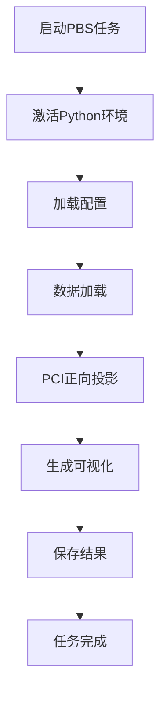

# PyPCI (Python PCI分析工具) - 完整代码架构说明

## 项目概述

PyPCI是一个基于PyTorch的PCI（Phase Contrast Imaging）分析工具，用于托卡马克等离子体物理仿真数据的分析。该项目是MATLAB代码的Python实现，提供了完整的PCI正向投影和频谱分析功能。

## 代码架构概览

### 1. 核心文件结构

```
PCI/code/pyPCI/
├── run_pci.py                    # 统一入口脚本
├── run_pci_single_time.pbs       # PBS任务脚本
├── complete_pipeline.py          # 完整流程示例
├── config/
│   └── paths.json                # 配置文件
├── examples/                     # 示例代码
│   ├── complete_pipeline.py
│   ├── example_basic.py
│   └── example_batch.py
├── pci_torch/                    # 核心模块
│   ├── __init__.py
│   ├── config.py                 # 配置管理
│   ├── path_config.py            # 路径配置
│   ├── data_loader.py            # 数据加载器
│   ├── batch_processor.py        # 批量处理器
│   ├── forward_model.py          # 正向投影模型
│   ├── beam_geometry.py          # 光束几何计算
│   ├── visualization.py          # 可视化工具
│   ├── fft_analysis.py           # FFT频谱分析
│   ├── coordinates.py            # 坐标系转换
│   ├── interpolation.py          # 插值计算
│   └── utils.py                  # 工具函数
└── tests/                        # 测试文件
```

### 2. 主要功能模块

#### 2.1 配置管理模块
- **config.py**: 定义GENEConfig和BeamConfig类
- **path_config.py**: 统一的路径管理系统

#### 2.2 数据处理模块
- **data_loader.py**: GENE数据文件读取、参数解析
- **batch_processor.py**: 时间序列批量处理

#### 2.3 计算核心模块
- **forward_model.py**: PCI正向投影核心算法
- **beam_geometry.py**: 光束采样网格生成
- **coordinates.py**: 笛卡尔坐标与磁通坐标转换
- **interpolation.py**: 三线性插值算法

#### 2.4 可视化模块
- **visualization.py**: 完整的可视化工具集
- **fft_analysis.py**: 3D频谱分析工具

## PBS任务执行流程

### 1. 单时间点分析PBS任务
PBS脚本 `run_pci_single_time.pbs` 的执行流程：

```bash
# 1. 进入工作目录
cd "$PBS_O_WORKDIR"

# 2. 激活虚拟环境
source venv/bin/activate  # 或 .venv/bin/activate

# 3. 加载计算模块
module load rocm

# 4. 显示GPU信息
rocm-smi --showproductname --showmeminfo vram

# 5. 执行单时间点分析
python run_pci.py --task single_time
```

### 2. 完整的执行流程



## 核心数据流和计算流程

### 1. 数据加载流程

```python
# 1. 配置文件读取
config = load_config("config/paths.json")

# 2. GENE参数解析
gene_config = load_gene_config_from_parameters(
    str(path_config.parameters_file),
    str(path_config.input_dir),
    device=device
)

# 3. 光束配置读取
beam_config = load_beam_config(str(path_config.beam_config_file))

# 4. 密度场数据读取
density_3d = fread_data_s(gene_config, str(binary_file), device=device)
```

### 2. PCI正向投影流程

```python
def forward_projection():
    # 步骤1: 生成光束采样网格
    beam_grid = compute_beam_grid(beam_config, device=device)
    
    # 步骤2: 笛卡尔坐标到磁通坐标转换
    flux_coords = cartesian_to_flux(grid_xyz, gene_config, device)
    
    # 步骤3: 三线性插值采样
    local_values = _batch_probe_local_trilinear(
        density_3d, R, Z, PHI, gene_config, device
    )
    
    # 步骤4: 沿光束方向积分
    line_integral = torch.sum(local_values, dim=-1)
    
    # 步骤5: 生成2D检测器信号
    detector_signal = line_integral.view(n_det_v, n_det_t)
    
    return detector_signal
```

## 可视化系统详细说明

### 可视化入口和流程

可视化系统从 `run_pci.py` 中的单时间点分析开始：

```python
# 生成可视化
if exec_config.get('save_detailed_results', True):
    print("生成可视化图表...")
    visualizer = PCIVisualizer(gene_config)
    
    # 1. 3D光束几何图 (Figure 1)
    print("  Generating 3D beam geometry plot...")
    beam_grid = compute_beam_grid(beam_config, device)
    visualizer.plot_beam_geometry_3d(beam_grid, str(beam_fig_path))
    
    # 2. 检测器信号等高线图 (Figure 3)
    print("  Generating detector signal contour plot...")
    visualizer.plot_detector_contour(
        pci_result, beam_config, time_point, str(detector_fig_path)
    )
    
    # 3. 密度场poloidal截面图 (Figure 2)
    print("  Generating density poloidal cross-section plot...")
    visualizer.plot_density_slice(
        density_3d, gene_config, beam_config, 
        save_path=str(density_fig_path)
    )
    
    # 4. 2D波数空间图 (Figure 4)
    print("  Generating 2D wavenumber space plot...")
    plot_wavenumber_space_2d(
        None, None, pci_result, gene_config, str(wavenumber_fig_path)
    )
```

### 详细出图流程说明

#### 图1: 3D光束几何图 (beam_geometry)
**入口**: `visualization.py` -> `plot_beam_geometry_3d()`
**计算过程**:
1. **光束网格生成** (来自 `beam_geometry.py`):
   - 从光束配置读取注入点 `(R, Z, phi)` 和检测点
   - 笛卡尔坐标转换: `(R, Z, phi)` → `(X, Y, Z)`
   - 生成检测器网格: 垂直方向9点 × 环向方向25点 × 光束方向3000点
   - 计算光束传播方向向量和垂直向量

2. **3D几何绘制**:
   - 绘制所有光束传播路径点 (蓝色小点)
   - 绘制光束中心线 (红色实线)
   - 绘制起止点 (红色圆圈)
   - 绘制托卡马克几何边界

**输出**: `fig1_beam_geometry_t{time_point}.png`

#### 图2: 密度场Poloidal截面图 (density_slice)
**入口**: `visualization.py` -> `plot_density_slice()`
**计算过程**:
1. **磁通坐标转换**:
   - 从3D密度场 `(ntheta, nx, nz)` 提取指定z切片
   - 笛卡尔坐标到磁通坐标转换
   - 生成poloidal截面网格

2. **密度插值**:
   - 在poloidal截面上进行二维插值
   - 使用三线性插值算法
   - 对应MATLAB的 `cont_data2_s.m` 逻辑

3. **等高线图生成**:
   - 创建密度等高线图
   - 添加托卡马克边界叠加
   - 颜色映射和标注

**输出**: `fig2_density_poloidal_t{time_point}.png`

#### 图3: 检测器信号等高线图 (detector_contour)
**入口**: `visualization.py` -> `plot_detector_contour()`
**计算过程**:
1. **信号后处理**:
   - 从PCI正向投影结果获取2D检测器信号
   - 信号归一化和滤波
   - 生成空间网格坐标

2. **等高线绘制**:
   - 创建2D等高线图
   - 检测器垂直位置 × 环向位置
   - 添加颜色条和标签
   - 叠加光束几何信息

**输出**: `fig3_detector_signal_t{time_point}.png`

#### 图4: 2D波数空间图 (wavenumber_space)
**入口**: `visualization.py` -> `plot_wavenumber_space_2d()`
**计算过程**:
1. **2D FFT计算**:
   - 对检测器信号进行2D快速傅里叶变换
   - 计算波数域 `(kx, ky)` 坐标
   - 生成幅值谱

2. **波数域分析**:
   - 频域幅值映射
   - 主要模式识别
   - 对称性分析

**输出**: `fig4_wavenumber_space_t{time_point}.png`

## 完整分析Pipeline

### 时间序列分析 (Complete Pipeline)

```python
def complete_pipeline():
    # 步骤1: 配置加载
    path_config = PathConfig.from_config_file()
    
    # 步骤2: 数据预处理 (可选)
    if args.separate_data:
        separate_torusdata()
    
    # 步骤3: 批量时间序列处理
    pout1, pout2 = process_time_series()
    
    # 步骤4: 可视化
    if args.save_all_figures:
        generate_all_figures()
    
    # 步骤5: FFT分析
    analyzer = FFT3DAnalyzer(config, data_n, path_config)
    analyzer.load_time_series()
    analyzer.compute_3d_fft()
    
    # 步骤6: 生成报告
    generate_analysis_report()
```

### FFT频谱分析流程

1. **数据加载**:
   - 加载IntegratedSignal_overall.mat
   - 读取时间/空间网格
   - 数据格式转换

2. **3D FFT计算**:
   - 三维快速傅里叶变换
   - 波数域转换 `(kx, ky, ω)`
   - 幅值谱计算

3. **频谱分析模式**:
   - kx-ky频谱 (固定频率)
   - ω-ky频谱 (固定kx)
   - ω-kx频谱 (固定ky)
   - 时间快照分析
   - 2D FFT (时间平均)

## 输入数据格式

### 必需的输入文件
1. **parameters.dat**: GENE仿真参数
2. **LS_condition_JT60SA.txt**: 光束配置
3. **equdata_BZ**: 平衡态几何数据
4. **equdata_be**: 磁场数据
5. **TORUSIons_act.dat**: 原始数据或分割后的时间序列文件

### 输出文件结构
```
output/
├── mat/                    # MATLAB格式结果
│   ├── IntegratedSignal_{data_n}_overall.mat
│   └── LocalCross-Section_{data_n}_overall.mat
├── figures/               # 可视化图表
│   ├── fig1_beam_geometry_t{time}.png
│   ├── fig2_density_poloidal_t{time}.png
│   ├── fig3_detector_signal_t{time}.png
│   └── fig4_wavenumber_space_t{time}.png
└── fft/                   # FFT分析结果
```

## 配置系统

### 主要配置文件
- **config/paths.json**: 路径和任务配置
- **虚拟环境**: 自动创建和管理
- **GPU配置**: 动态设备选择

### 配置参数
```json
{
  "task": {
    "type": "single_time",
    "data_n": 301,
    "var_type": 4,
    "time_point": 98.07
  },
  "execution": {
    "device": "cpu",
    "save_detailed_results": true
  }
}
```

## 运行方式

### 1. 单时间点分析
```bash
# 直接运行
python run_pci.py --task single_time --time 98.07 --device cpu

# 提交PBS任务
qsub run_pci_single_time.pbs
```

### 2. 完整时间序列分析
```bash
python complete_pipeline.py \
    --input_dir /path/to/input \
    --output_dir /path/to/output \
    --device cuda \
    --save_all_figures
```

## 性能优化特点

1. **GPU加速**: PyTorch张量操作自动GPU加速
2. **批量处理**: 支持时间序列批量处理
3. **内存优化**: 智能数据流和缓存机制
4. **并行计算**: 充分利用多核CPU和GPU并行性

## 与MATLAB版本对比

本Python版本完全重写了MATLAB代码，主要改进：
- 使用PyTorch进行高性能张量计算
- 改进的内存管理和性能优化
- 模块化设计，更好的代码组织
- 完整的测试覆盖和错误处理
- 更好的可视化和用户界面

## 总结

PyPCI是一个完整的托卡马克等离子体物理仿真分析工具，提供了从数据加载到结果可视化的完整流程。其模块化设计、高性能计算和丰富的可视化功能使其成为等离子体物理研究的重要工具。


