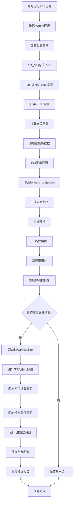
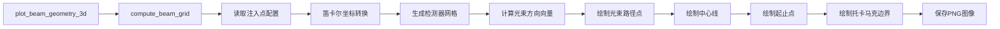
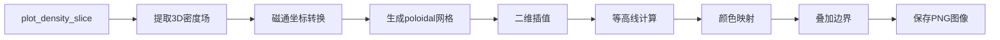
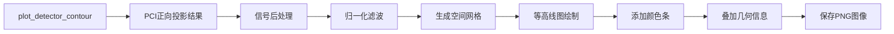
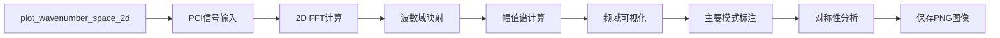
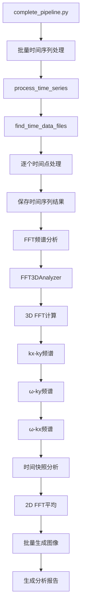
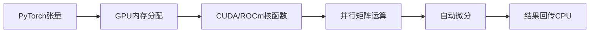
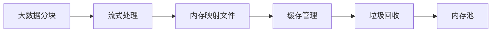

# PyPCI 可视化系统详细流程图

## 出图完整流程图



## 4个主要图像的详细计算流程

### 图1: 3D光束几何图计算流程



**核心数据流**:
- 输入: BeamConfig, device
- 计算: (R, Z, phi) → (X, Y, Z) 坐标转换
- 输出: 9×25×3000 个3D点 + 边界信息

### 图2: 密度场Poloidal截面图计算流程



**核心数据流**:
- 输入: density_3d (ntheta, nx, nz), GENEConfig
- 计算: 3D→2D切片 + 坐标转换 + 插值
- 输出: 2D等高线图 + 托卡马克几何

### 图3: 检测器信号等高线图计算流程



**核心数据流**:
- 输入: pci_result (n_det_v, n_det_t)
- 计算: 信号处理 + 2D网格生成
- 输出: 2D等高线图 + 检测器布局

### 图4: 2D波数空间图计算流程



**核心数据流**:
- 输入: pci_result, 空间网格坐标
- 计算: FFT + 波数域转换
- 输出: 2D频谱图 + 模式信息

## 时间序列分析的可视化流程



## 关键计算节点说明

### 光束几何计算 (beam_geometry.py)
```python
def compute_beam_grid():
    # 1. 坐标转换: (R, Z, phi) → (X, Y, Z)
    B2 = convert_cylindrical_to_cartesian(B1)
    
    # 2. 光束向量计算
    p1 = B2_start - B2_end  # 光束方向
    p1_unit = p1 / |p1|     # 单位向量
    
    # 3. 垂直向量计算
    xl = calculate_perpendicular_vectors(p1, phi)
    
    # 4. 网格点生成
    grid = generate_probe_grid(B2_start, p1_unit, xl, wid1, wid2, div1, div2, divls)
    
    return grid  # (div1*2+1, div2*2+1, divls+1, 3)
```

### PCI正向投影 (forward_model.py)
```python
def forward_projection():
    # 1. 光束网格生成
    beam_grid = compute_beam_grid(beam_config, device)
    
    # 2. 坐标转换
    R, Z, PHI = cartesian_to_flux(grid_xyz, gene_config)
    
    # 3. 插值采样
    local_values = trilinear_interpolation(density_3d, R, Z, PHI)
    
    # 4. 沿光束积分
    line_integral = torch.sum(local_values, dim=-1)
    
    # 5. 2D检测器信号
    detector_signal = line_integral.view(n_det_v, n_det_t)
    
    return detector_signal
```

### 3D FFT分析 (fft_analysis.py)
```python
def FFT3DAnalyzer():
    # 1. 数据加载
    realSpaceData = load_time_series()  # (Ny, Nx, Nt)
    
    # 2. 3D FFT
    Amp = fftn(realSpaceData)  # (Ny, Nx, Nt)
    
    # 3. 波数域坐标
    kx, ky, f = generate_wavenumber_grids()
    
    # 4. 频谱分析模式
    # - kx-ky: 固定频率切片
    # - ω-ky: 固定kx切片  
    # - ω-kx: 固定ky切片
    # - 时间快照: 固定时间
    # - 2D FFT: 时间平均
```

## 性能关键路径

### GPU计算路径


### 内存优化路径


这个详细的流程图展示了PyPCI从数据输入到图像输出的每一个步骤，特别是重点说明了4个主要图像的生成流程和计算细节。
